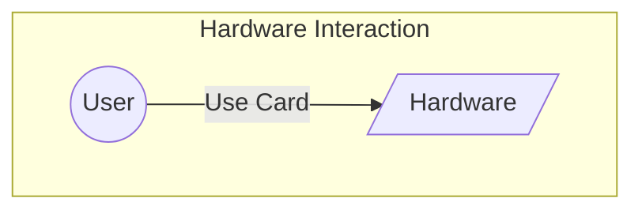
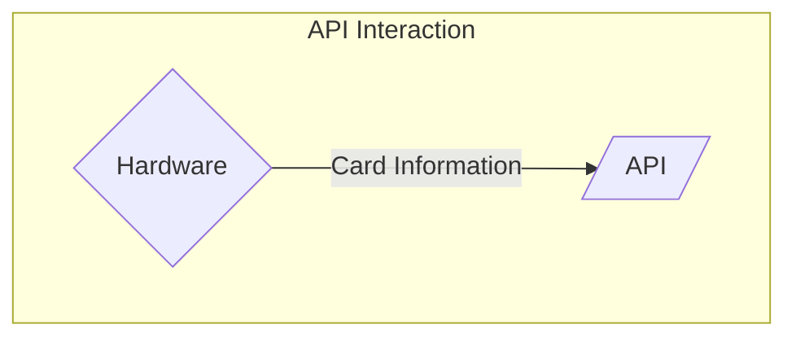
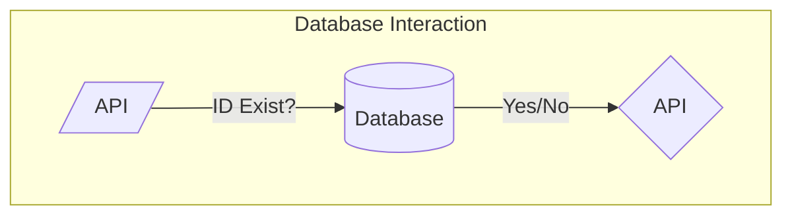
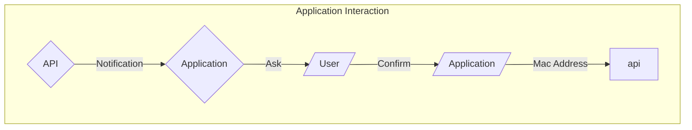
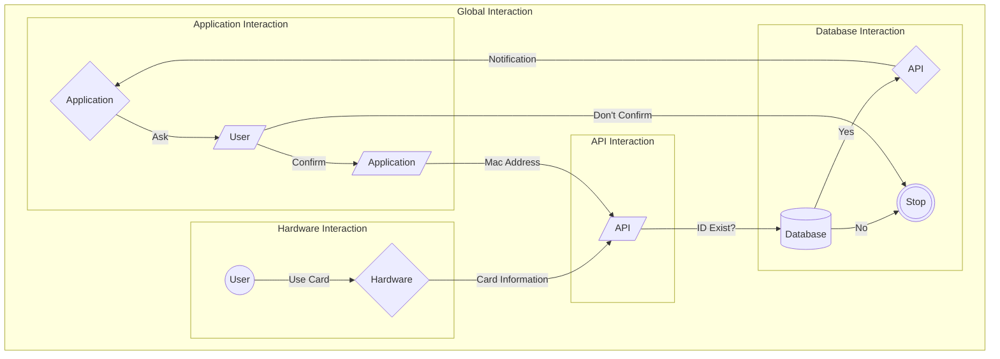

# Functional Specification Document

## Project Overview
- **Project Name:** 
- **Project Manager:** [DESPAUX Guillaume](https://github.com/GuillaumeDespaux)
- **Date:** 12/08/2024
- **Version:** 0.1

## Table of Contents
1. [Introduction](#1-introduction)
2. [Objectives](#2-objectives)
3. [Scope](#3-scope)
    1. [For Companies/Organizations](#31-for-companiesorganizations)
    2. [For Users](#32-for-users)
4. [Out of Scope Features](#4-out-of-scope-features)
    1. [For Companies/Organizations](#41-for-companiesorganizations)
    2. [For Users](#42-for-users)
    3. [General](#43-general)
5. [Functional Requirements](#5-functional-requirements)
    1. [Hardware](#51-hardware)
    2. [API](#52-api)
    3. [Application (2FA)](#53-application-2fa)
    4. [Database](#54-database)
    5. [Global Interaction Overview](#55-global-interaction-overview)
6. [Non-Functional Requirements](#6-non-functional-requirements)
    1. [Performance](#61-performance)
    2. [Security](#62-security)
    3. [Usability](#63-usability)
7. [Use Cases](#7-use-cases)
8. [Assumptions and Constraints](#8-assumptions-and-constraints)
9. [Glossary](#9-glossary)
10. [Appendices](#10-appendices)

## 1. Introduction
Some years ago when I where trainer with my parents, doing roll call was a simple and straightforward task. We had approximately 10 trainees per session, so there where no difficulty at all for this task. However when I stopped being a trainer, and became myself a trainee again, I understood that doing this task, depends on the size of the organization. For instance when I arrived in 2023 at ALGOSUP's school and saw Jean-Philipe losing around 20 to 30 minutes each morning and afternoon doing the roll call. This observation have been making me thinking: "Why don't we automate this task?".

## 2. Objectives
This is why today I present this project as moon shot. The main goal is to stop losing time doing this, and for companies who don't want lose energy. The main purpose is to create something easy to use, compatible with a lot of computers, and also make it the less expensive as possible.

## 3. Scope
<!-- Define the scope of the project, including what is in scope and what is out of scope. -->
The goals for those products are to simplify the life of each companies that have daily registration with many people.

### 3.1. For Companies/Organizations:
- **Ease to use**: Designed to be intuitive and straightforward, minimizing the need for training or specialized skills.
- **Quick access to results**: Provides fast and reliable attendance reports to streamline decision-making and operations.
- **Automation of roll call**: Eliminates the need for manual attendance-taking, saving time and reducing errors.
- **Time saving**: Frees up valuable time for employees to focus on higher priority tasks.

### 3.2. For Users:
- **Ease to use**: Simple interface to ensure smooth user interaction without confusion.
- **Improved discipline**: Encourages punctuality and accountability through reliable tracking systems.
- **Enhanced productivity**: Allows users to focus on their work rather than attendance-related tasks, contributing to overall efficiency.
- **Compatibility**: The users will be able to use the software for any computers (Windows, macOs, Linux).
## 4. Out of Scope Features

### 4.1. For Companies/Organizations:
- **Automatically assigning blame**: The system will not determine or assign fault to individuals, as this exceeds the intended purpose of simplifying roll calls and introduces ethical and technical challenges.
- **Integration with disciplinary systems**: Features for managing disciplinary actions, such as issuing warnings or escalating absences, are not included.

### 4.2. For Users
- **Predicting lateness**: The system will not forecast lateness using external factors (e.g., traffic or weather) due to the complexity and additional resources required for such functionality.
- **Preventing absences**: The system’s role is limited to recording attendance, not actively preventing absences or enforcing user behavior.
- **Productivity tools**: Features like reminders or personal notifications to improve time management are outside the scope.
- **Phones**: The system's compatibility will be only on computers discarding the phones option.

### 4.3. General:
- **Unrelated functionalities**: Any features not directly related to automating roll calls or tracking attendance will not be addressed in this project.

## 5. Functional Requirements

### 5.1 Hardware
- **Internet Connectivity**: The hardware must be connected to the Internet to communicate with the [API](#api).
- **Local Data Storage**: The hardware should store data locally in case of Internet connectivity issues.
- **Data Transmission**: The hardware must send data online at least twice a day to ensure information readability.
- **User Identification Creation**: The system should allow the creation of new user identification cards.
- **User Identification Reading**: The system must read user identification cards to retrieve information.
- **User Identification Updating**: The system should provide an update mechanism for users who leave the organization.
- **User Identification Deletion**: The system must be able to delete user identification card information.

### 5.2 API
- **Information Reception from Hardware**: The [API](#api) must receive information from the hardware for analysis.
- **Information Sorting**: The [API](#api) should efficiently sort all received information.
- **Information Transmission**: The [API](#api) must send information to the application to confirm the second step of authentication.

### 5.3 Database
- **Store Information**: The [database](#database) must securely store all user and attendance information, ensuring data integrity and availability.
- **Give Information**: The [database](#database) should provide quick and reliable access to stored information for authorized users and systems.
- **Keep Information A Certain Amount Of Time**: The [database](#database) must retain information for a specified duration, complying with organizational policies and legal requirements.

### 5.4 Application ([2FA](#2fa))
- **Role Differentiation**: Users will have different options based on their roles within the organization.
- **Background Operation**: The application should run in the background, displaying pop-ups based on user roles.
- **Unique User Identification**: The application must obtain the computer's [MAC address](#mac-address) to ensure the person activating the hardware is the same person validating through the application.

### 5.5 Global Interaction Overview

## 6. Non-Functional Requirements
<!-- List the non-functional requirements, such as performance, security, and usability. -->
### 6.1 Performance
- **Battery Life**: The hardware should have a long-lasting battery to ensure continuous operation throughout the day without frequent recharging.
- **Duration**: The system must be capable of handling high volumes of data and user interactions without degradation in performance over extended periods.
- **Response Time**: The system should provide quick response times for all operations, including user identification, data transmission, and report generation, to ensure a seamless user experience.

### 6.2 Security
- **[GDPR](#gdpr) Compliance**: The system must comply with [GDPR](#gdpr) regulations to protect user data and ensure privacy.
- **Account Security**: User accounts should be protected with strong authentication mechanisms to prevent unauthorized access.
- **Role-Based Access Control**: The system should implement role-based access control to ensure that users can only access information and perform actions that are relevant to their roles.

### 6.3 Usability
- **Compatibility with Computers**: The system should be compatible with various operating systems, including Windows, macOS, and Linux, to ensure broad usability.
- **Exclusion of Phones**: The system is designed to be used on computers only, and will not support mobile phone compatibility.
- **Authentication System**: The system should include a robust authentication system to verify user identities and ensure secure access to the application and data.

## 7. Use Cases
<!-- Describe the use cases for the project. Each use case should include a description, actors involved, preconditions, postconditions, and the main flow of events. -->

## 8. Assumptions and Constraints
<!-- List any assumptions and constraints that apply to the project. -->

## 9. Glossary

- **[2FA](#2fa) (Two-Factor Authentication):** A security process in which the user provides two different authentication factors to verify themselves.
- **[API](#api) (Application Programming Interface):** A set of rules and definitions that allows software programs to communicate with each other.
- **[GDPR](#gdpr) (General Data Protection Regulation):** A regulation in EU law on data protection and privacy for all individuals within the European Union and the European Economic Area.
- **[MAC Address](#mac-address) (Media Access Control Address):** A unique identifier assigned to network interfaces for communications on the physical network segment.
- **[Hardware](#hardware):** The physical components of a computer system.
- **[Database](#database):** An organized collection of data, generally stored and accessed electronically from a computer system.
- **Local Data Storage:** The storage of data on a local device rather than on a remote server.
## 10. Appendices
<!-- Include any additional information or documents that support the functional specification. -->