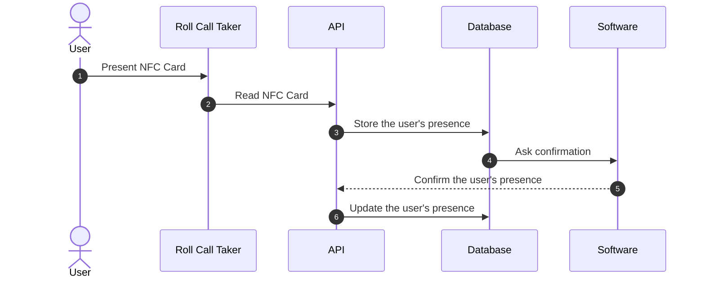
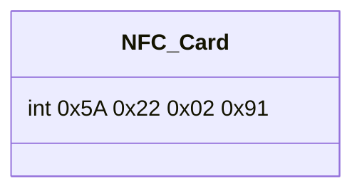
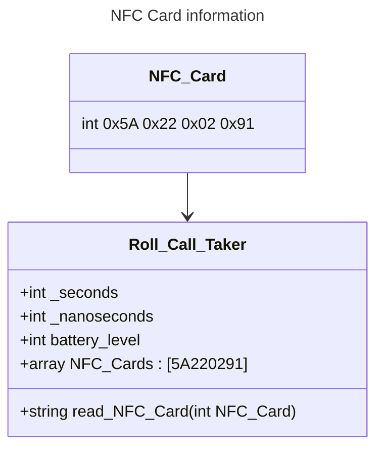
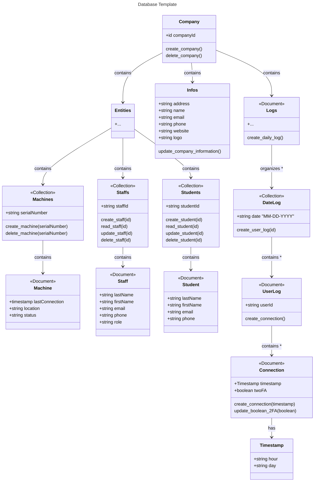

# Technical Specification Document

## 1. Project Overview

<div align="center">

**Project Name: None**<br>
**Project Manager:** [DESPAUX Guillaume](https://github.com/GuillaumeDespaux)<br>
**Last Update:** 01/29/2025<br>
**Version:** 0.1.0

</div>

## 2. Table of Contents

<details close>
<summary>Table of Contents</summary>

- [Technical Specification Document](#technical-specification-document)
  - [1. Project Overview](#1-project-overview)
  - [2. Table of Contents](#2-table-of-contents)
  - [3. Introduction](#3-introduction)
  - [4. Objectives](#4-objectives)
    - [4.1. Roll Call Taker](#41-roll-call-taker)
    - [4.2. Database](#42-database)
    - [4.3 API (Application Programming Interface)](#43-api-application-programming-interface)
    - [4.4. Software](#44-software)
  - [5. Project Folder Structure](#5-project-folder-structure)
  - [6. Convention](#6-convention)
    - [6.1. Naming Convention](#61-naming-convention)
    - [6.2. Code Convention](#62-code-convention)
      - [6.2.1. General](#621-general)
      - [6.2.2. Arduino](#622-arduino)
      - [6.2.3. API](#623-api)
      - [6.2.4. Software](#624-software)
  - [7. System Architecture](#7-system-architecture)
    - [7.1. Roll Call Taker](#71-roll-call-taker)
    - [7.2. Database](#72-database)
    - [7.3. API](#73-api)
      - [GET](#get)
      - [POST](#post)
      - [PATCH](#patch)
      - [DELETE](#delete)
    - [7.4. Software](#74-software)
  - [8. Processing Flow](#8-processing-flow)
  - [9. Information Handling](#9-information-handling)
    - [9.1. NFC Card](#91-nfc-card)
    - [9.2. Roll Call Taker](#92-roll-call-taker)
    - [9.3. Database](#93-database)
    - [9.4. API](#94-api)
    - [9.5. Software](#95-software)
    - [9.6. Overview](#96-overview)
  - [10. Internet Connectivity Issues](#10-internet-connectivity-issues)

</details>

## 3. Introduction

This project aims to develop a roll call taker solution linked to a database and a software. The roll call taker will be able to take roll calls of users and store them in a database. The software will be able for the users, to confirm their presence with an 2FA[^x] (Two Factor Authentication) system and for the administrator to manage the users presence or absence.

## 4. Objectives

The objectives of this project are:

### 4.1. Roll Call Taker

- Develop a roll call taker solution using Arduino[^y] language.
- Using a NFC[^z] reader to read the user's NFC card.
- Store the user's presence in a database.
- Connect the device to internet to send the data.

### 4.2. Database

- Develop a database structure to register companies, users and roll calls using Firebase[^a].
- Secure the database access for the users and the administrator.

### 4.3 API (Application Programming Interface)

- Develop an API[^b] to connected the Roll Call Taker to the database.
- Develop the routes to create a communication between the database and the administrators.

### 4.4. Software

- Develop a desktop software to manage the users presence using #TODO.
- Develop a 2FA system to confirm the user's presence.
- Identify the users with a device such as a smartphone or a computer (Mac Address[^c]) and the current internet connection.

## 5. Project Folder Structure

```bash #TODO
.
├── documents                      # Is for project documentation
│   ├── images                     # Is for storing images used in documentation
│   ├── management                 # Is for management documents
│   │   └── weekly_reports         # Is for weekly reports
│   ├── quality                    # Is for quality assurance documents
│   └── user_manual                # Is for user manuals
└── src                            # Is for source code
    ├── api                        # Is for API-related code
    │   ├── node_modules           # Is for Node.js modules
    │   ├── package-lock.json      # Is for npm package lock file
    │   ├── package.json           # Is for npm package configuration
    │   └── server.js              # Is for the API server code
    ├── app                        # Is for application code
    └── arduino                    # Is for Arduino code
```

## 6. Convention

This part is about the naming and code convention to follow during the development of the project.

### 6.1. Naming Convention

|**Type**|**Example**|**Convention Name**|
|---|---|---|
|Folder|`folder_name`|snake_case|
|File|`file_name`|snake_case|
|Variable|`bestVariable`|camelCase|
|Function|`best_Function`|camel_Snake_Case|
|Class|`className`|camelCase|
|Constant|`BestConstant`|PascalCase|
|Define|`BEST_DEFINE`|CONSTANT_CASE|
|Typedef|`TPDF_NAME`|CONSTANT_CASE|
|Structure|`s_Structure`|camel_Snake_Case|

>[!NOTE]
>
> - **Class :** Each class have to contain `class` in the name.
> - **Typedef :** Each typedef have to contain `TPDF` in the name.
> - **Structure :** Each structure have to contain `s_` in the name.

### 6.2. Code Convention

#### 6.2.1. General

```cpp
// Header file example .cpp
#include <iostream>
#include "library.hpp"

// Namespace
using namespace std;

// Constants
#define BEST_DEFINE 0

// Typedef
typedef int TPDF_NAME;

// Structure
struct s_Structure {
    int member;
};

// Class
class className {
    public:
        // Constructor
        className();
        // Destructor
        ~className();
        // Function
        void bestFunction();
    private:
        // Variable
        int bestVariable;
};

// Function
/** // Documentation
 * @brief Function description
 * @param arg Description of the argument
 * @return Description of the return
 */
int function(int arg);  // Will be placed in the include file (e.g. library.hpp)

int function(int arg) {
    return arg;
}
```

#### 6.2.2. Arduino

```cpp
// Header file example .ino
#include <Adafruit_PN532.h> // Imported library
#include "library.h"        // My library

/*
  Initialize variables, objects, etc.
*/

void setup() {  // Setup the initializations
  // Setup code
}

void loop() {   //Core of the code
  // Loop code
}
```

```h
// Header file example .h
#ifndef LIBRARY_H
#define LIBRARY_H


#endif
```

#### 6.2.3. API

```js
// Header file example .js
const bestConstant = require('bestConstant');

```

#### 6.2.4. Software

<!-- #TODO -->

```electron

```

## 7. System Architecture

### 7.1. Roll Call Taker

The roll call taker is a device that will be used to take the roll calls of the users. The device will be composed of the following elements:

<!-- #TODO (Blueprint/schematics) -->

### 7.2. Database

The current database used is Firebase. The database is structured as follows:

```bash
├── company (collection)
│   ├── entities (document)
│   │   ├── machines (collection)
│   │   │   └── id
│   │   ├── staff (collection)
│   │   │   └── id
│   │   └── students (collection)
│   │       └── id
│   ├── infos (document)
│   │   ├── address
│   │   ├── name
│   │   └── ect ...
│   └── logs (document)
│       └── MM-DD-YYYY (collection)
│           └── user XXXX (document)
│               └── connections (collection)
│                   └── connection1 (document)
│                       └── timestamp : (hour)
│                       └── 2FA : (boolean)
```

### 7.3. API

The API is a `Node.js` server that will be used with the `Express` library to connect the Roll Call Taker to the database and the database to the software and vice versa. The API will be composed of the following elements:

#### GET

|Methods|Path|Query|Description|
|---|---|---|---|
|**GET**|/api/:collection/|`companyId`|Returns the company information|
|**GET**|/api/:collection/staffs/|`companyId`|Returns a list of all staff members|
|**GET**|/api/:collection/staffs/:id|`companyId`, `staffId`|Returns the information of a staff member|
|**GET**|/api/:collection/students/|`companyId`|Returns a list of all students|
|**GET**|/api/:collection/students/:id|`companyId`, `studentId`|Returns the information of a student|
|**GET**|/api/:collection/machines/|`companyId`|Returns a list of all machines|
|**GET**|/api/:collection/machines/:id|`companyId`, `serialNumber`|Returns the information of a machine|
|**GET**|/api/:collection/logs/|`companyId`|Returns the logs of the company|
|**GET**|/api/:collection/logs/:date|`companyId`, `date`|Returns the logs of the company for a specific date|
|**GET**|/api/:collection/logs/:date/:id|`companyId`, `date`, `userId`|Returns the logs of the company for a specific date and a specific user|

#### POST

|Methods|Path|Query|Description|
|---|---|---|---|
|**POST**|/api/:collection/staffs/|`companyId`|Create a new staff member|
|**POST**|/api/:collection/students/|`companyId`|Create a new student|
|**POST**|/api/:collection/machines/|`companyId`|Create a new machine|
|**POST**|/api/:collection/logs/:date|`companyId`, `date`|Create a new log for a specific date|
|**POST**|/api/:collection/logs/:date/:id|`companyId`, `date`, `userId`|Create a new log for a specific date and a specific user|

#### PATCH

|Methods|Path|Query|Description|
|---|---|---|---|
|**PATCH**|/api/:collection/|`companyId`|Update the company information|
|**PATCH**|/api/:collection/staffs/:id|`companyId`, `staffId`|Update the information of a staff member|
|**PATCH**|/api/:collection/students/:id|`companyId`, `studentId`|Update the information of a student|
|**PATCH**|/api/:collection/machines/:id|`companyId`, `serialNumber`|Update the information of a machine|
|**PATCH**|/api/:collection/logs/:date/:id|`companyId`, `date`, `userId`|Update the log of a specific date and a specific user|

#### DELETE

|Methods|Path|Query|Description|
|---|---|---|---|
|**DELETE**|/api/:collection/staffs/:id|`companyId`, `staffId`|Delete a staff member|
|**DELETE**|/api/:collection/students/:id|`companyId`, `studentId`|Delete a student|
|**DELETE**|/api/:collection/machines/:id|`companyId`, `serialNumber`|Delete a machine|
|**DELETE**|/api/:collection/logs/:date/:id|`companyId`, `date`, `userId`|Delete the log of a specific date and a specific user|

### 7.4. Software

The software is a desktop application for `Windows`, `macOS`, `Linux` that will be used to manage the users presence. The software will be composed of the following elements:

<!-- #TODO -->

## 8. Processing Flow



## 9. Information Handling

This part will be about all the information that will be handled during the project with their format.

### 9.1. NFC Card

The NFC Card will contain the following information:



### 9.2. Roll Call Taker

The Roll Call Taker will contain the following information:



### 9.3. Database

The database will handle the following information:



### 9.4. API

The API is responsible for handling various types of information and ensuring secure and efficient communication between the Roll Call Taker, the database, and the software. The following details outline the information handling aspects of the API:

|Data|Type|Description|
|---|---|---|
|`companyId`|?|The unique identifier of the company|
|`staffId`|int|The unique identifier of the staff member|
|`studentId`|int|The unique identifier of the student|
|`serialNumber`|int|The unique identifier of the machine|
|`date`|String|The date of the log|
|`userId`|int|The unique identifier of the user|
|`timestamp`|String|The time of the connection|
|`2FA`|Boolean|The status of the Two Factor Authentication|

### 9.5. Software

### 9.6. Overview

## 10. Internet Connectivity Issues


[^x]: Two Factor Authentication
[^y]: Arduino
[^z]: Near Field Communication
[^a]: Firebase
[^b]: Application Programming Interface
[^c]: Mac Address
